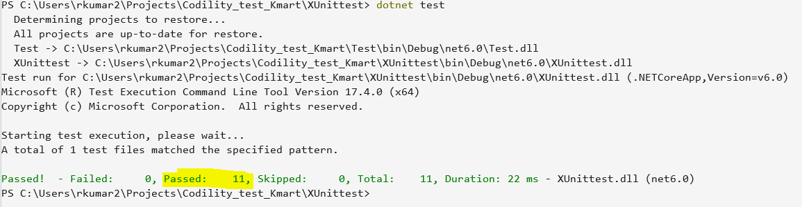

# Codility_test_Kmart
#This test project developed in .Net 6.
#it support docker container 

 #Open a terminal in the directory where your this project is located, and run the following command to build this project: 

Dotnet Cmd:

1. dotnet build
2. dotnet run

Docker cmd:

1. docker build -t test-app .      //build desirable image name
2. docker run --rm -it test-app    //Once the Docker image is built, you can run the container to execute your application

XUnit test cases Execuation Cmd:
#Open a terminal in the directory where your this project is located, and run the following command to build this project: 

1. dotnet test

Test cases report snapshots:

 

